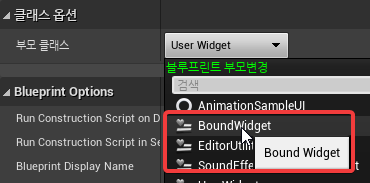
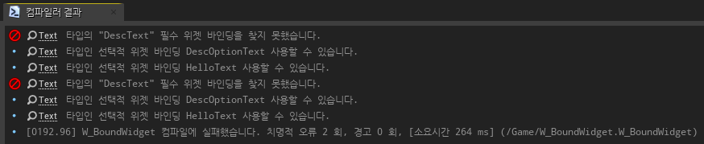
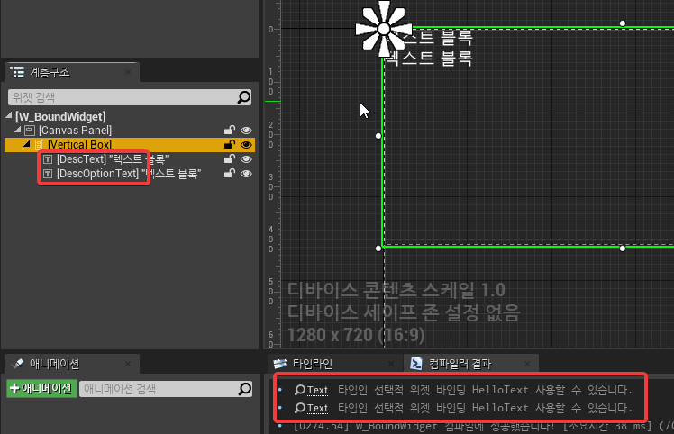
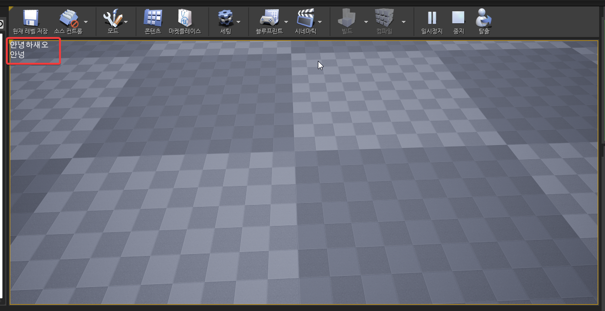

# 서론
UserWidget을 상속받은 C++ 클래스에서 에디터에서 만들어진 UMG 위젯에 원하는 위젯이 배치되어있는지 검증할 수 있고, 코드에서 원하는 위젯을 조작하고자 할 때, 위젯 트리로 해당 위젯을 찾는 단계 없이 접근할 수 있어서 최적화 효과도 있는 매크로

# 적용

어차피 위젯 부모를 변경하면 블루프린트 컴파일 에러가 발생하기 때문에 위젯 블루프린트와 코드는 순서가 다르거나 동시에 작업해도 상관 없다. 

## 코드 작성

`BoundWidget.h`

```cpp
#pragma once

#include "CoreMinimal.h"
#include "Blueprint/UserWidget.h"
#include "BoundWidget.generated.h"

UCLASS(Abstract)
class BOUND_API UBoundWidget : public UUserWidget
{
	GENERATED_BODY()


public:

	//~ Begin UserWidget Interfaces
	virtual void NativeConstruct() override;
	//~ End UserWidget Interfaces

public:

	UPROPERTY(meta=(BindWidget))
	class UTextBlock* DescText;

	UPROPERTY(meta=(BindWidget, OptionalWidget=true))
	class UTextBlock* DescOptionText;

	UPROPERTY(meta=(BindWidgetOptional))
	class UTextBlock* HelloText;
};
```

`BoundWidget.cpp`

```cpp
#include "BoundWidget.h"
#include "Components/TextBlock.h"

#define LOCTEXT_NAMESPACE "Bound"

void UBoundWidget::NativeConstruct()
{
	DescText->SetText(LOCTEXT("안녕하새오", "안녕하새오")));

	if (DescOptionText != nullptr)
	{
		DescOptionText->SetText(LOCTEXT("안넝", "안넝"));
	}

	if (HelloText != nullptr)
	{
		HelloText->SetText(LOCTEXT("핵", "핵"));
	}

	Super::NativeConstruct();
}

#undef LOCTEXT_NAMESPACE
```

## 위젯 블루프린트 작업



상속을 `UserWidget` 대신 위에 코드에서 만든 `BoundWidget`으로 변경



Optional 지정된 애들은 없지만 컴파일 에러가 발생하지 않음을 알 수 있다.



블루프린트 컴파일 오류가 나지 않도록 코드와 위젯 이름을 변경

## 동작 확인



`SetText`하는 로직을 `NativeConstruct`에 때려넣었기 때문에 대충 뷰포트에 생성한 위젯을 붙여보면 동작하는 것을 볼 수 있다.

# 결론

UI가 많은 모바일 프로젝트일 경우에는 필요할 것같은데, 아직 UI 양이 많은 프로젝트에 제대로 적용해보지는 못했다.

규모가 커졌을 때 우려되는 점은 두개정도 있을 것같다.

위젯 블루프린트와 1:1로 대응하는 C++ 클래스가 필요할 수도 있다는 점.

이건 구조에 따라서 달라질 것 같은데 어설프게 로직이 같다고 같은 클래스를 사용하다가는 불필요한 로직이 많아질 것 같아서 되도록 Optional도 사용하지 않고 블루프린트와 C++가 강하게 묶여서 거의 1:1로 대응하는게 낫지 않을까 싶다.

위젯 블루프린트를 누군가 컴파일 에러 발생하는 채로 저장해버리면, PIE로 플레이할 때 에러를 발견하지 못할 수 있다. 모든 UI가 초기화 단계에서 생성해둔다면 상관 없는 일이지만 필요할 때만 UI를 생성하고 있다면 그 UI를 열어서 생성될 때 발견되기 때문에, 테스트할 때 발경하지 못하고 게임을 배포하려고 쿠킹하고 패키징하는 시점에 발견되는 불상사가 발생할 수 있을 것 같다.

에디터 전체 블루프린트를 컴파일 하는 기능이 있으면 패키징 시점보다는 먼저 발견될텐데 블루프린트가 에셋으로 관리되고 있어서 로드되기 전까지 컴파일에러가 발견되지 않는다는게 아쉬운 점이다.