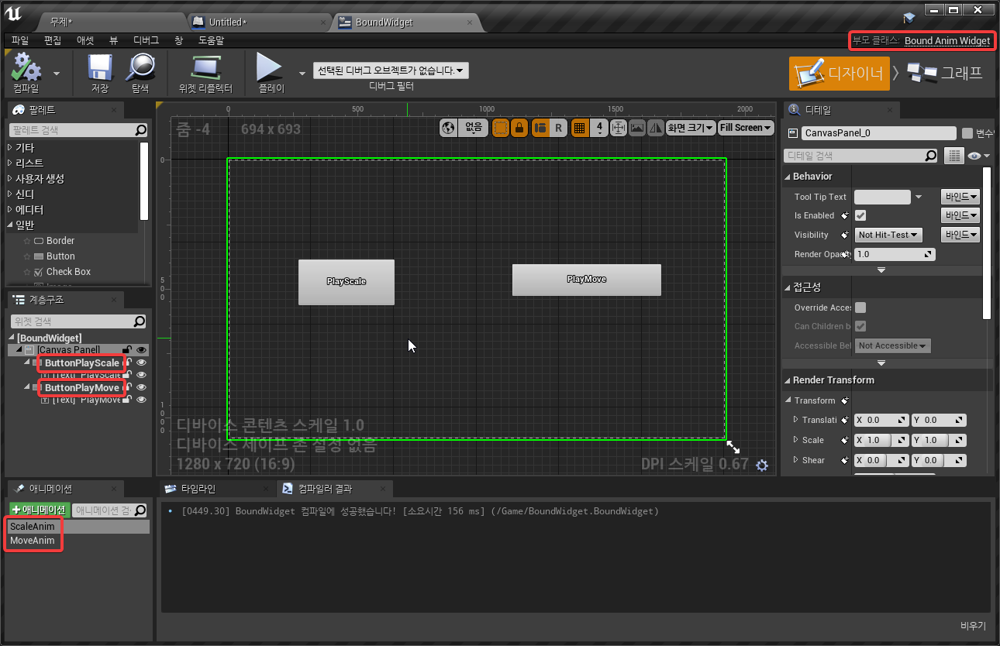

# 서론

`BindWidget`과 마찬가지로 `meta=(BindWidgetAnim)`을 붙이되 `UPROPERTY`에 `Transient`가 있어야함.

https://github.com/EpicGames/UnrealEngine/commit/2d8e4cc332cf60cc8c8b2de3d9c3de7e7adbbdc4

전에는 안그랬던 모양인데 `4.26.1` 부터 블루프린트 컴파일 단계에서 Transient인지 검사하는 로직이 들어간 듯함. Transient가 아니면 블루프린트 컴파일 에러가 발생하므로 추가해주자

# 적용

## 코드 작성

`BoundAnimWidget.h`

```cpp
#pragma once

#include "CoreMinimal.h"
#include "Blueprint/UserWidget.h"
#include "BoundAnimWidget.generated.h"


UCLASS(Abstract)
class DEPRECATED_API UBoundAnimWidget : public UUserWidget
{
	GENERATED_BODY()

public:

	//~ Begin UUserWidget Interface
	virtual void NativeConstruct() override;
	//~ End UUserWidget Interface

private:

	UFUNCTION()
	void OnClickPlayScale();
	UFUNCTION()
	void OnClickPlayMove();

public:

	UPROPERTY(meta=(BindWidget))
	class UButton* ButtonPlayScale;

	UPROPERTY(meta=(BindWidget))
	class UButton* ButtonPlayMove;

	UPROPERTY(Transient, meta=(BindWidgetAnim))
	class UWidgetAnimation* ScaleAnim;

	UPROPERTY(Transient, meta=(BindWidgetAnim))
	class UWidgetAnimation* MoveAnim;
};

```

`BoundAnimWidget.cpp`

```cpp
#include "BoundAnimWidget.h"
#include "Components/Button.h"

void UBoundAnimWidget::NativeConstruct()
{
	ButtonPlayScale->OnClicked.AddDynamic(this, &UBoundAnimWidget::OnClickPlayScale);
	ButtonPlayMove->OnClicked.AddDynamic(this, &UBoundAnimWidget::OnClickPlayMove);

	Super::NativeConstruct();
}

void UBoundAnimWidget::OnClickPlayScale()
{
	PlayAnimation(ScaleAnim);
}

void UBoundAnimWidget::OnClickPlayMove()
{
	PlayAnimation(MoveAnim);
}
```

## 위젯 블루프린트 작업


BindWidget처럼 부모 클래스를 C++에서 만든 클래스로 변경하고 블루프린트 컴파일이 성공하도록 이름을 맞추고 컴파일

## 동작 확인



# 결론

BindWidget과 크게 다른점 없고 애니메이션을 이벤트로 블루프린트로 연결해서 재생하지 않고, C++에서 
재생시킬 수 있다는 것정도가 장점이려나..

애니메이션은 위젯보다 프로그래머 보다는 UI 디자이너가 관리해야하는 상황이 있을 수 있지 않을까.. 해서 BindWidgetAnim을 사용하기 보다는 C++에서는 애니메이션을 재생해야하는 시점을 이벤트를 심어두고 실제 애니메이션 재생등은 블루프린트에서 하는게 낫지 않을까..?
