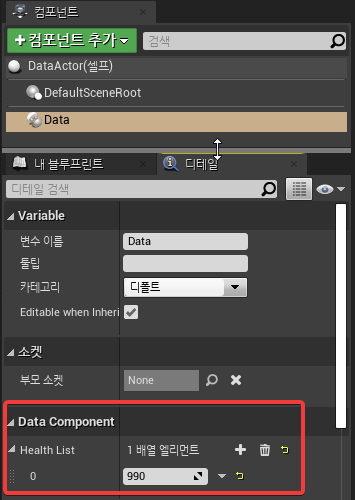

# 서론

`UPROPERTY`로 지정한 변수가 에셋, 레벨 등에 저장 데이터를 가지고 다른 구조 변수로 데이터를 옮겨야 할 때, 데이터를 유지하면서 구조를 변경을 에셋을 저장할 때 버전을 붙여서 `DEPRECATED` 를 붙여서 데이터를 처리하고 이후부터 저장할 땐 데이터를 버릴 수 있다.

`DEPRECATED`를 붙이지 않고 `CustomVersion`만 적용하면 cm 단위로 저장했던 데이터를 m 단위를 변경한다거나 하는 용도로도 사용할 수 있을 것 같다.

이 글에서는 `DEPRECATED` 를 써먹을 방법만 적고있다.

# 예제 

## 구조 변경 전 데이터를 세팅

### C++로 컴포넌트와 데이터를 저장할 변수를 작성

에디터를 켜서 빈 C++ 프로젝트를 생성하고 `ActorComponent`를 상속받은 `DataComponent`라는 컴포넌트를 작성하고 변경 전 데이터를 저장할 `Health`라는 변수를 `EditAnywhere`로 추가한다.

`DataComponent.h`
```cpp
#pragma once

#include "CoreMinimal.h"
#include "Components/ActorComponent.h"
#include "DataComponent.generated.h"


UCLASS( ClassGroup=(Custom), meta=(BlueprintSpawnableComponent) )
class DEPRECATED_API UDataComponent : public UActorComponent
{
	GENERATED_BODY()

public:

	UPROPERTY(EditAnywhere)
	uint32 Health;
};
```

`DataComponent.cpp`
```cpp
#include "DataComponent.h"
```

### `DataComponent`을 임의의 `Actor`에 붙여서 저장하기

`DataActor` 라는 `Actor`를 상속받은 블루프린트 생성하고 `DataComponent`를 추가해서 `Health` 값을 변경하고 저장한다.


## CusomVersion을 정의

CustomVersion을 사용하는 이유는 이 방식은 상속, 배치된 데이터들을 한번에 갱신해주는 것이 아닌 각 데이터가 로드되는 시점에 데이터를 변환해서 처리하는 것으로, 로드하고 나서 저장하지 않으면 계속 `DEPRECATED` 처리되기 전의 데이터가 저장되어있기 떄문에, 관련된 데이터가 들어있는 에셋, 레벨을 모두 로드 후 저장하지 않을 경우 DEPRECATED 붙이기 전 데이터가 저장되어있는 상태이다.

구석에 숨어있던 데이터가 먼 미래에 불러져도 처리될 수 있게, 변환 로직과 DEPRECATED 변수는 계속 남아있어야 한다.

### DataComponent를 위한 CustomVersion을 정의한다.

`DataComponentCustomVersion.h`
```cpp
#pragma once

#include "CoreMinimal.h"
#include "Misc/Guid.h"

struct FDataComponentCustomVersion
{
	enum Type
	{
		HealthToHealthList = 0,

		// -----<new versions can be added above this line>-------------------------------------------------
		VersionPlusOne,
		LatestVersion = VersionPlusOne - 1
	};

	const static FGuid GUID;

private:
	FDataComponentCustomVersion() {}
};
```

전체적인 구조는 엔진 소스에 정의되어있는 다른 `CustomVersion` 처리를 참고했으며, 이 컴포넌트에서 계속 변경할 데이터가 생기는 경우 `VersionPlusOne` 위쪽에 1 씩 값을 증가시키면서 추가해서 처리하면 된다.

`DataComponentCustomVersion.cpp`
```cpp
#include "DataComponentCustomVersion.h"
#include "Serialization/CustomVersion.h"

const FGuid FDataComponentCustomVersion::GUID(0xEB508D38, 0x27E81CE9, 0x1A7409F3, 0x1DA57CED);

// Register the custom version with core
FCustomVersionRegistration GRegisterDataComponentCustomVersion(FDataComponentCustomVersion::GUID, FDataComponentCustomVersion::LatestVersion, TEXT("DataComponentVer"));
```

GUID에 정의한 상수는 다른 CustomVersion(엔진에서도 여러군데에서 CustomVersion이 사용되는것을 볼 수 있다)과 겹치지 않게 넣어줘야해서 대충 아래 코드로 엘릭서에서 나온 4개 숫자를 넣았다.

```elixir
iex> 0..3 |> Enum.map(fn _ -> 0x100_000_000 |> :rand.uniform() |> Kernel.-(1) |> Integer.to_string(16) end)
["EB508D38", "27E81CE9", "1A7409F3", "1DA57CED"]
```

## 값을 옮길 변수를 추가하고 이전 변수를 DEPRECATED

임의로 Health를 HealthList라는 배열로 구조를 변경한다고 해보자

`DataComponent.h`
```cpp
public:
	UPROPERTY()
	uint32 Health_DEPRECATED;

	UPROPERTY(EditAnywhere)
	TArray<uint32> HealthList;
```

위와 같이 새로운 구조인 `HealthList`를 정의하고 `Health`는 `Health_DEPRECATED`로 변경하고 UPROPERTY에 붙어있는 매크로들을 제거해준다.

`UPROPERTY`에 `EditAnywhere`같은 매크로가 남아있으면 `DEPRECATED`된 변수는 붙일 수 없다는 아래와 같은 컴파일 에러가 발생한다.

```bash
DataComponent.h(24) : LogCompile: Error: Member variable declaration: Deprecated property 'Health_DEPRECATED' should not be marked as visible or editable
```

## 값을 변경해서 처리

### `Serialize` 함수를 상속받아 정의해준다.

`DataComponent.h`
```cpp
public:

	//~ Begin UObject Interface.
	virtual void Serialize(FArchive& Ar) override;
	//~ End UObject Interface.
```

`DataComponent.cpp`
```cpp
#include "DataComponentCustomVersion.h"

void UDataComponent::Serialize(FArchive& Ar)
{
	Super::Serialize(Ar);

	Ar.UsingCustomVersion(FDataComponentCustomVersion::GUID);

	const int32 ArVersion = Ar.CustomVer(FDataComponentCustomVersion::GUID);
	if (ArVersion < FDataComponentCustomVersion::HealthToHealthList)
	{
		HealthList.Add(Health_DEPRECATED);
	}
}
```

예제에서 작성한 `DataComponent`는 `ActorComponent`를 상속받은 클래스라 `Serialize` 함수를 상속받아서 처리하고 있는데, `UObject`를 상속받지 않고 별도로 작성된 `Serialize`하고 있는 구조체나 클래스인 경우는 `Serialze`를 상속받지 않고 처리될 수도 있다.

## 값 갱신을 확인

`ArVersion`에는 `CustomVersion`을 추가하기 전의 데이터가 저장되어있으므로 `-1`이 들어있다.


`Health_DEPRECATED`에는 위에서 `Health`에 저장했던 `990` 이 들어있는 것을 알 수 있다.

여기선 `Health`를 제거한 버전보다 낮은 버전일 경우 데이터를 `HealthList`에 추가하도록 작성이 되어있다.

에디터상에서도 컴포넌트의 HealthList로 기존 값이 옮겨진 것을 확인할 수 있다.



이 때, 에디터상에서는 변경점이 없는 걸로 나오지만 저장하고 나서 에셋을 리로드해보면 `ArVersion`이 0으로 갱신되서 `HealthList`에 데이터를 옮겨담는 로직이 동작하지 않고 `Health_DEPRECATED`에는 변경했던 값도 저장되어있는 걸 확인할 수 있다.


# 결론

한참 엔진 코드 둘러볼 때 봐뒀던 기능인데 이리저리 생각해봐도 이 기능을 사용할 경우는 별로 없을 것같다.

특히 서비스 중이 아닌 개발중인 프로젝트라면 오히려 딱 한번 모든 데이터를 돌면서 갱신해주고, 변수 자체를 코드에서 제거해주는게 좋아보인다.

괜히 CustomVersion을 여기저기 덕지덕지 붙여놨다가는 분석할 필요가 없는 코드임에도 이 변수는 어디에서 쓰는 값인가 분석할 거리만 쌓일 것 같다.

이런 기능이 언리얼에 있구나 정도만 알고 넘어가면 될 것같다.
