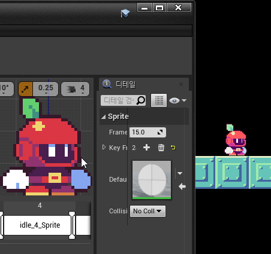
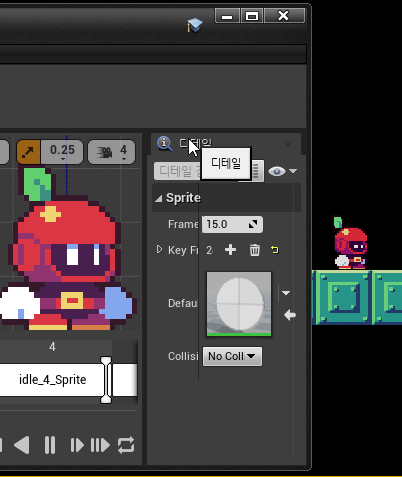

# 결론

예전에 설정했었다가 최근에 다시 작업할 때 까먹어서 그대로 작업하다가 다시 발견해서 기록해둔다

|적용 전|적용 후|
|---|---|
|||

## 전체 프로젝트에 적용

세팅 > 프로젝트 세팅 > 엔진 > 렌더링 > Default Settings > 자동 노출 바이어스 를 1.0에서 0.0으로 변경

사실 이 세팅 부분에서 자동 노출 부분이 기본값으로 비활성되어있어서 동작 안해야하는거 아닌가? 싶은데 나중에 엔진 코드를 확인해봐야겠다..

## 특정 포스트 프로세스에 적용

레벨에 배치된 포스트 프로세스 > 디테일 > Lens > Exposure > 노출 보정 을 활성화하고 1.0에서 0.0으로 변경

특정 레벨에만 적용하고 싶은 경우에는 포스트 프로세스 볼륨을 배치하고 설정한 뒤에 `Infinite Extend (Unbound)` 옵션을 활성화 해서 레벨 전체에 포스트 프로세스가 적용되도록 하면 될듯.

## 특정 카메라에만 적용

카메라 컴포넌트 > 디테일 > Post Process > Lens > Exposure > 노출 보정 을 활성화하고 1.0에서 0.0으로 변경

# 주절주절

## 하나

원인은 Auto Exposure 라이팅이 너무 밝거나 어두운 지역을 이동할때 카메라가 밝기에 적응하면서 밝기를 완화해주는 효과로 보이는데 unlit 머티리얼을 사용하는 스프라이트들이 모두 조명인데다가 레벨에 다른 조명은 하나도 배치되어있지 않아서 Auto Exposure가 어두운 환경에 적응하면서 밝아보이는 것으로 보인다.

이 내용은 라이팅을 사용하지 않는 2D 프로젝트에 대한 걸로 라이팅을 사용하는 프로젝트라면 Paper2D 에셋에 머티리얼을 unlit가 아니라 lit 머티리얼을 사용할테니 이 문제는 발생하지 않을 듯

## 둘

사실 처음에 프로젝트 세팅에서 못찾아서 캐릭터에 붙인 카메라에 세팅하고 작업하고 있었는데 나중에 보니 카메라 컴포넌트 쪽에는 `노출 보정` 으로 번역해놓고 프로젝트 세팅쪽은 `노출 바이어스`로 번역을 해놨네.. 영어 에디터를 써야하나..

## 셋

컬러피커로 스프라이트 에디터나 텍스쳐 에셋을 열어서 카메라에 보이는 배치된 걸 비교해보면 여전히 실제 텍스쳐랑은 색상 차이가 조금 난다.

톤매퍼나 블룸 설정등 이리저리 만져보면 값이 비슷해지긴 하는데 아직 완전히 같아지는 설정은 찾지못했다.

일단 본문 내용으로는 과하게 밝게 보이는 부분은 해결됐고 계속 조금씩 만져봐야할 듯
